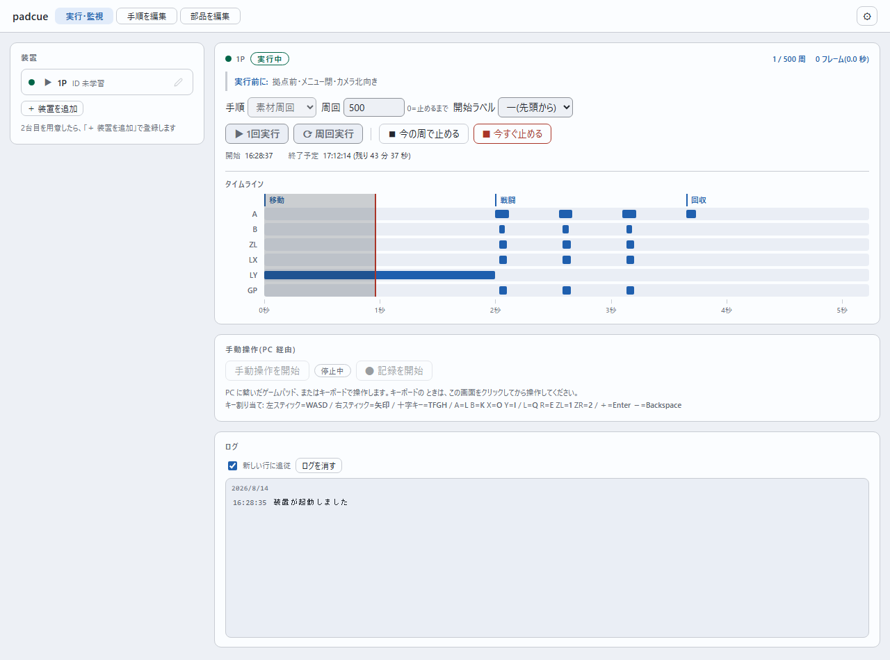
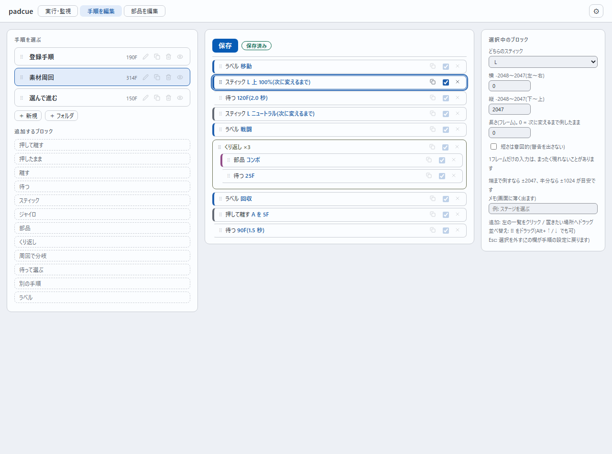

# padcue — Nintendo Switch 2 自動操作システム

> **任天堂株式会社とは一切関係の無い、非公式の個人プロジェクト**です。公認も後援
> も受けていません。**オフライン/ローカルの用途に限って**ください(詳細は
> [使う前に](#使う前に)と [NOTICE](NOTICE))。

PC で書いた手順を、マイコン(M5Stack AtomS3 Lite)が Switch 2 のコントローラーとし
て高い時間精度で実行します。長時間の周回作業の代行と、フレーム単位の精密な挙動検
証が目的です。

**PC 側は Python の標準ライブラリだけで動きます**(外部パッケージの導入は不要)。
**2台同時運用**まで実機で検証済みです — 装置ごとのレーン画面、「連結」でのまとめて
開始・自動合流・連動停止、割り当てのプリセット保存、どの Switch につながっているかの
自動表示。初代 Switch でも動作します。

**セットアップは [docs/runbook.md](docs/runbook.md)**(2台目の追加は §8、連結の使
い方は §9)。

> 固有用語は [docs/glossary.md](docs/glossary.md) にまとまっています。



装置ごとのレーンで、手順・周回数・開始位置を選んで走らせます。タイムラインは
「何フレーム目に何を押すか」をそのまま表しています。

---

## 要るもの

|          |                                                                          |
|----------|--------------------------------------------------------------------------|
| PC       | Windows。Python 3.10 以上と、ブラウザ(Chrome / Edge など)                |
| マイコン | M5Stack AtomS3 Lite を1台(2台同時運用なら2台)                            |
| ケーブル | データ通信できる USB-C ケーブル。最初の書き込みだけに使い、以後は無線    |
| Switch   | 本体と純正ドック。本体設定の「Pro コントローラーの有線通信」を ON にする |

**実機が無くても、模擬デバイス付きの練習モードで全機能を試せます。**

---

## 入手

```powershell
git clone https://github.com/eoforgu0/padcue.git
cd padcue
```

git を使わない場合は、このページの **Code → Download ZIP** から取得して
展開してください。**インストールは要りません**(PC 側は Python の標準ライブラリだけで
動きます)。以下のコマンドは、この `padcue` フォルダの中で実行します。

---

## 使い方(3分)

**`padcue.bat` をダブルクリック**すると操作画面が開きます。
実機が無いうちは **`padcue-練習.bat`**(模擬デバイス付き)で全機能を試せます。

はじめて開いたときは手順がまだ1つもありません。雛形を作ると、画面の一覧に出ます:

```powershell
$env:PYTHONPATH = "pctool"
python -m padcue init         # サンプルの手順と部品を作る
```

手順は `procedures/`、部品は `parts/` に保存されます(バッチと同じ場所)。

コマンドから使う場合:

```powershell
python -m padcue gui          # 操作画面
python -m padcue mock         # 模擬デバイス(別の端末で)
```

操作画面で手順を選び、タイムライン(いつ何のボタンを押すか)を確認して実行します。
手順の作成・編集も同じ画面で行います(ファイルを直接いじる必要はありません)。

**実機がある場合**は `padcue device auto`(LAN 内を探して覚える)に変えるだけで、
同じ操作が実機に対して行われます。はじめての一台は
[docs/runbook.md](docs/runbook.md) を参照。

---

## 使う前に

- 任天堂株式会社とは**一切関係の無い、非公式の個人プロジェクト**です。公認も後援も
  受けていません。「Nintendo Switch」等は同社の商標で、本文書では対象機器を指す
  ためだけに使っています(詳細は [NOTICE](NOTICE))
- **オフライン/ローカルの用途に限って**ください。オンライン対戦やランキングでの
  使用は利用規約に反する可能性があり、アカウント停止を含む結果は利用者の責任です
- マイコンの制御ポートに**認証はありません**(同じ LAN の誰でも操作できます)。
  信頼できる家庭内ネットワークでだけ使い、インターネットに露出させないでください
- 無人で長時間動かす道具です。暴走したときはマイコン前面のボタンを**1.5秒長押し**
  すれば、全ボタンを離して止まります(操作画面の「今すぐ止める」と同じ)

---

## 手順の書き方

**ふだんは操作画面で作ります。**



左のブロックを置いていくと手順になります。くり返し・分岐・部品の呼び出しも
ブロックです。以下はその保存形式で、git で差分を見たいとき、まとめて書き換え
たいとき、他のツールと行き来したいときに直接編集できます。

手順は2階層です。**流れ**は JSON、**高密度な同時入力**は CSV(1行=1フレーム)で書きます。

`procedures/素材周回.flow.json` — 流れ

```json
{
  "schema": 1, "name": "素材周回", "pre": "拠点前・メニュー閉",
  "body": [
    {"type": "label", "text": "移動"},
    {"type": "stick", "side": "L", "x": 0, "y": 2047},
    {"type": "wait", "frames": 120},
    {"type": "loop", "count": 3, "body": [
      {"type": "part", "ref": "コンボ"},
      {"type": "wait", "frames": 25}
    ]}
  ]
}
```

`parts/コンボ.csv` — 同時入力(1行=1フレーム)

```csv
F,A,B,ZL,LX,GP
1,1,,,,
2,1,,,,
3,1,1,1,-1200,300
4,,,,,
```

**ルール**

- 数値はすべて**生値**。スティックは中心 0 の -2048〜+2047(左と下が負)。`+1` が
  送信分解能の最小刻み
- ジャイロ(GP/GY/GR)は毎フレームの回転速度(生値)
- CSV の**空セル**は「離す/0」。操作画面で作った部品は**全ての入力を明示**します
  (手書きの CSV で列そのものを省いた場合だけ「直前の状態を継続」)
- **くり返しは書いた区間の正確な再生**。押しっぱなしを周回にまたがせたい場合は
  loop の前で押す
- 危ない書き方(1フレームの押下=まったく現れないことがある、0フレームで消える操作、
  周回の継ぎ目の衝突)は変換時に警告

詳細は [docs/specs/flow-format.md](docs/specs/flow-format.md)。

---

## 構成

```text
docs/           設計文書(下記)
firmware/       マイコン側(ESP-IDF)
  components/pademu_core/   移植可能な純粋C(手順の解釈・実行・プロトコル)
  main/                     ESP32 固有(USB・タイマー・通信・保存・状態機械)
pctool/         PC 側(Python。コンパイラ・通信・CLI・GUI・模擬デバイス)
```

文書の一覧と選び方は [docs/README.md](docs/README.md) にあります。設計を頭から
追う場合の順:

0. [glossary.md](docs/glossary.md) — 固有用語
1. [hardware-design.md](docs/hardware-design.md) — 何を作るのか、なぜこの構成か(第
   一原理は「入力精度」)
2. [specs/procedure-format.md](docs/specs/procedure-format.md) — 手順データの形
   式と実行モデル
3. [specs/flow-format.md](docs/specs/flow-format.md) — 手順の書き方(正本形式)
4. [specs/comm-protocol.md](docs/specs/comm-protocol.md) — PC とマイコンの通信
5. [design/firmware-architecture.md](docs/design/firmware-architecture.md) — マ
   イコン内部の設計
6. [design/procon-protocol.md](docs/design/procon-protocol.md) — コントローラー
   として名乗るためのプロトコル(実測値つき)
7. [design/gui-principles.md](docs/design/gui-principles.md) — 画面の見た目・文
   言・配置を説明できる状態に保つための原則

---

## 開発

開発用の依存(利用者には不要):

```powershell
pip install -e "./pctool[dev]"   # pytest と playwright
playwright install chromium      # 画面を実際に動かす検査に使う
```

以下はすべてリポジトリ直下で実行します。

```powershell
# PC 側のテスト(実機不要。C 実装の検証も含む)
python -m pytest -q

# GUI を実際にブラウザで操作して想定と突き合わせる
python pctool/tools/uicheck.py <出力先>

# 手順書(docs/runbook.md)のとおりになぞって、ずれていないか確認する
python pctool/tools/runbook_walk.py <出力先>

# 画面の見た目を確認(明暗テーマのスクリーンショット)
python pctool/tools/shoot.py <出力先> [--dark]

# 文書の表の桁を、表示幅で揃え直す(--check だけなら確認のみ)
python pctool/tools/mdtable.py docs/<文書>.md

# マイコン側のビルド(ESP-IDF 5.5 以上。Windows は PowerShell から)
cd firmware
idf.py build

# 実機への無線更新(2回目以降。ケーブル不要)
python -m padcue ota
```

テストは実機なしで次を検証します:

- 手順のコンパイル結果(タイミング・警告)
- **C 実行エンジンと Python 参照実装の送出列が完全一致すること**
- **模擬 Switch に対してプロトコル応答が仕様どおりであること**
- 転送・実行・停止・ログ回収の一連(模擬デバイス)
- 手順名・部品名の検証(プロジェクトの外に書かない・消さない)
- GUI サーバーと実機の接続の扱い(1本を持ち回す・切れたら繋ぎ直す)
- **通し検証**: 手順を書いてから Switch が受け取るバイト列まで

`tools/uicheck.py` はブラウザを実際に動かし、実行・停止・部分実行・待機分岐・
編集・取り消し・未保存警告・未接続時の抑止などを「こうしたらこうなるはず」で
照合します(失敗した項目はスクリーンショットを残します)。

上記はすべて [CI](.github/workflows/ci.yml) でも回します(PC 側の検査と lint、
Windows でのブラウザ検査、ファームウェアのビルドと割り込み経路の配置確認)。

- 版ごとの変更は [CHANGELOG.md](CHANGELOG.md)
- 変更するときの決まりは [CONTRIBUTING.md](CONTRIBUTING.md)
- 安全上の前提と脆弱性の報告先は [SECURITY.md](SECURITY.md)

---

## ライセンス

[Apache License 2.0](LICENSE)。

ただし純正コントローラーから採取した HID レポートディスクリプタ203バイトなど、
第三者に権利がある要素が含まれます。扱いは [NOTICE](NOTICE) を参照してください。
